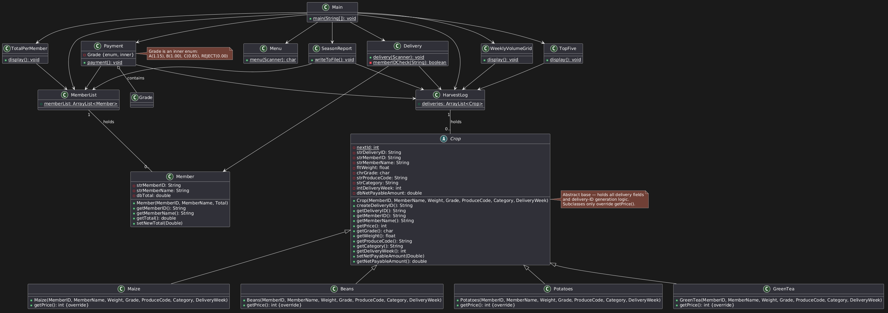
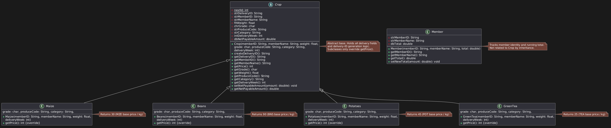

REKOLT Produce Tracker

Java console app for the REKOLT Planters' Cooperative (Fictif - Mauritius) that records produce deliveries, applies the
cooperative's payment rules, and generates a season report as a Word document.

Author: TKS (Tooshar Kumar Sauntoo) - t.sauntoo@alustudent.com  
Module: Programming II - Formative 1 Project, ALCHE

Payment rules (summary)

| Step              | Rule                                                                      |
|-------------------|---------------------------------------------------------------------------|
| 1. Base value     | mass × base price (MZE 30, BNS 90, POT 45, TEA 25 MUR/kg)                 |
| 2. Grade          | A (85–100) ×1.15 · B (70–84) ×1.00 · C (50–69) ×0.85 · REJECT (<50) ×0.00 |
| 3. Category       | Cereal ×1.00 · Perishable ×0.90 · Cash crop ×1.10                         |
| 4. Commission     | 5% of value after step 3                                                  |
| 5. Transport levy | 2 MUR per kg                                                              |
| Net payable       | After step 3 − commission − levy                                          |

REJECT deliveries are recorded and count for volume, but pay 0 and incur no deductions.

Reference: M-0042, 236 kg BNS, score 91 → 22,732.70 MUR (matches spec worked example).

Types and precision

Quantity: Mass
Type: double
Why: Fractional kg allowed (e.g. 412.5)

Quantity: Base price
Type: int
Why: Whole MUR/kg, fixed tariffs - no fractions

Quantity: Multipliers
Type: double
Why: 1.15, 0.90, 1.10 etc. - fractional, must not truncate

Quantity: All intermediate values
Type: double
Why: Never rounded until display. Rounding only via String.format("%.2f", ...) at print time — spec says "rounded
on display only"

Quantity: Scores, week
Type: int
Why: Whole numbers in bounded ranges (0–100, 1–20)

Quantity: IDs, codes
Type: String
Why: Patterned text (M-0042, D-0001, MZE) - not numeric quantities

No explicit casts needed where int widens to double in multiplication. Truncating casts avoided — they would lose data before validation.

Build and run

bash
git clone <repo-url> rekolt-tracker
cd rekolt-tracker
mvn clean compile
mvn exec:java -Dexec.mainClass="mu.rekolt.app.Main"

Requires JDK 17+ and Maven 3.6+.

UML Diagram-

Full project

Just the classes

Version control

Git used and pushed directly on github

